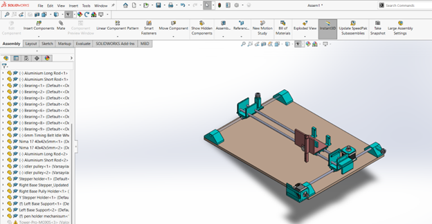
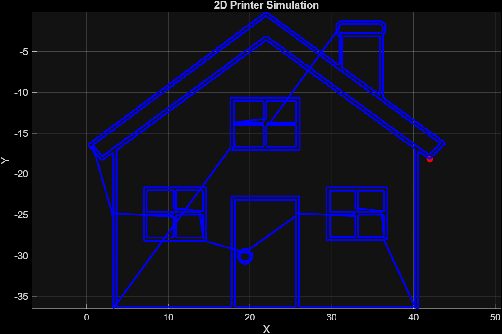

<div align="center">

# Chitrakaar
**2D CNC Pen Plotter**


</div>

---

## Overview

Chitrakaar is a belt-driven 2D CNC pen plotter that autonomously reproduces digital images on paper. The system extracts edges from an input image, converts them into G-code toolpaths, and executes them via an Arduino-based motion controller driving two stepper motors and a servo-actuated pen lift mechanism.

```
Input Image → MATLAB (G-code) → Python (Serial) → Arduino (Motion) → Paper
```
---

## Hardware

| Component | Specification |
|---|---|
| Microcontroller | Arduino Uno R4 |
| Motor Shield | CNC Shield V3 |
| Stepper Drivers | A4988 × 2 |
| Stepper Motors | NEMA 17 × 2 |
| Servo Motor | Standard PWM servo |
| Linear Motion | 8mm chrome-steel rods + LM8UU bearings |
| Drive Mechanism | Timing belt and pulley |
| Pen Lift | Servo-actuated rack and pinion |
| Power Supply | 12V DC adapter |

> Full bill of materials: [`2d-Printer List of Items.csv`](2d-Printer%20List%20of%20Items.csv)

---

## Mechanical Design



The frame uses chrome-plated carbon-steel smooth rods on a rigid rectangular base. X and Y axes use LM8UU linear bearings riding on 8mm guide rods, driven by NEMA 17 steppers via timing belts. The Z-axis pen lift is achieved through a servo motor coupled to a rack-and-pinion mechanism, converting angular displacement into precise vertical pen motion. The drawing surface remains stationary throughout operation.

> CAD files: [`3d_Parts/`](3d_Parts/)

---

## Electronics


The CNC Shield V3 mounts directly onto the Arduino Uno R4. A4988 drivers are seated in the X and Y slots. The servo connects to the onboard Pin 11 servo header on the shield.


> Detailed wiring reference: [`Circuits_and_Code/Connections.txt`](Circuits_and_Code/Connections.txt)

---

## Physical Build


---

## Software Pipeline

### 1. G-code Generation - MATLAB
**File:** `Image_to_GCode/ImagetoGCodeConverter.m`

Processes an input image into a `.gcode` toolpath file. Performs binary thresholding, manual edge detection, nearest-neighbour path ordering, coordinate scaling, and pen-lift segmentation. Outputs `M3` (pen down) and `M5` (pen up) commands at stroke boundaries.

**Key parameters:**
| Parameter | Effect |
|---|---|
| `step` | Point density - lower value gives smoother output (`1` = maximum quality) |
| `scale` | Physical drawing size |
| `dist` threshold | Pen lift sensitivity - lower value reduces mid-stroke lifts |




### 2. Serial Communication - Python
**File:** `Circuits_and_Code/Plotter_Code.py`

Transmits the generated G-code to the Arduino line by line over USB serial. Update the COM port and filename before running:

```python
ser = serial.Serial('COM3', 115200)   # update port as needed
open("Yourgcodefilepath.gcode", "r")            # update filename to match output
```

### 3. Firmware - Arduino
**File:** `Circuits_and_Code/Stepper_Servo_Controller.cpp`

Custom G-code interpreter running on the Arduino. Parses incoming commands, drives X/Y steppers via the A4988 drivers, and controls the servo for pen actuation. Sends `done` over serial after each command is executed.

**Supported commands:**
| Command | Action |
|---|---|
| `G1 X__ Y__` | Move to coordinate (drawing stroke) |
| `G0 X__ Y__` | Rapid travel (pen lifted) |
| `M3` | Lower pen (servo → 30°) |
| `M5` | Raise pen (servo → 90°) |

---

## Repository Structure

```
CNC-PENPLOTTER/
├── 3d_Parts/                        ← SolidWorks assembly + STL files
├── Circuits_and_Code/               ← Arduino firmware, Python sender, circuit diagram, wiring reference
├── Demo_Media/                      ← Build photos and demo video
├── Image_to_GCode/                  ← MATLAB script, sample input image, sample G-code, simulation output
├── 2d-Printer List of Items.csv     ← Bill of materials
└── README.md
```

---

## How to Run

```
1. Upload  Stepper_Servo_Controller.cpp  to Arduino via Arduino IDE (USB only, no 12V)
2. Run     ImagetoGCodeConverter.m       in MATLAB - update image path and output path
3. Connect hardware - CNC shield on Arduino, steppers to X/Y headers, servo to Pin 11, 12V to shield
4. Run     python Circuits_and_Code/Plotter_Code.py  - update COM port if needed
```

---

## Acknowledgements

Developed as part of **ME-205: Design Lab-I** at the **Indian Institute of Technology Ropar**, under the supervision of **Dr. Satwinder Jit Singh**.

*March 2026 - April 2026*